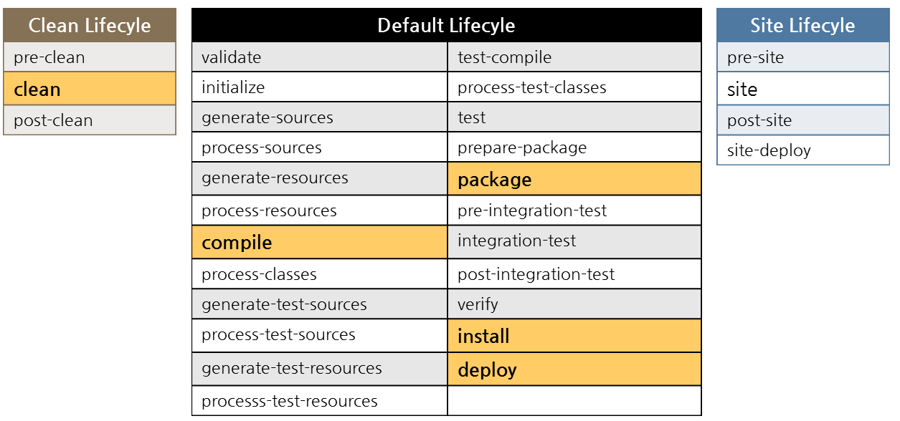
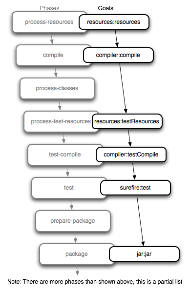

# Maven

* 필요한 라이브러리를 특정 문서(`pom.xml`)에 정의해 놓으면 네트워크를 통해서 라이브러리를 자동으로 다운로드.

## 장점

1. 라이브러리 관리를 편리하게 해줌.
2. 프로젝트의 작성부터 컴파일, 페트스(?) 등 프로젝트 라이프사이클에 포함되는 각 테스트 지원
3. war파일 기반의 배포용으로도 자주 사용.

## 플러그인

* Maven은 플러그인을 구동해주는 프레임워크(plugin execution framework)
* 모든 작업은 플러그인에서 수행
* 플러그인은 다른 산출물(artifacts)와 같이 저장소에서 관리
* Maven은 여러 플러그인으로 구성되어 있으며, 각각의 플러그인은 하나 이상의 Goal(명령, 작업)을 포함하고 있다.

### Goal


* Maven의 실행 단위
* 플러그인과 골의 조합으로 실행한다. ex) `mvn <plugin>:<goal> = mvn archetype:generate`
* Maven은 여러 Goal을 묶어서 lifecycle phases로 만들고 실행한다. ex) `mvn <phase> = mvn install`

## Maven의 LifeCycle



* 프로젝트 생성에 필요한 단계(phase)들을 Build Lifecycle이라고 한다.
* LifeCycle은 Build Phase로 구성되며 일련의 순서를 가진다.
* phase는 실행단위로서 goal과 바인딩된다.
* 빌드를 담당하는 Default, 제거를 담당하는 Clean, 배포를 담당하는 Site 라이프사이클이 존재

#### Build default 라이프사이클의 주요 phase


## 의존성

* 개발자는 프로젝트의 `pom.xml` 파일에 dependency만 정의해주면 Maven이 repository에서 검색하여 자동으로 추가해준다.
* 또한 참조하고있는 library까지 모두 추가해준다.
* 이를 '의존성 전이'라고 한다.

### 의존관계 제한

불필요한 라이브러리 다운로드를 방지하기 위해 추가기능을 제공한다.

* Dependency mediation : 버전이 다른 두개의 라이브러리가 동시에 의존 관계에 있을 경우 Maven은 좀더 가까운 의존관계에 있는 하나의 버전만 선택
* Dependency management : 직접 참조하지는 않으면서 하위 모듈이 특정 모듈을 참조할 경우, 특정 모듈의 버전을 지정
* Dependency scope : 현재 Build 단계에 꼭 필요한 모듈만 참조할 수 있도록 참조 범위를 지정
  * compile : 기본값, 모든 classpath에 추가, 컴파일 및 배포 때 같이 제공
  * provided : 실행 시 외부에서 제공, 예를 들면 WAS에서 제공되어 지므로 컴파일 시에는 필요하지만, 배포시에는 빠지는 라이브러리들
  * runtime : 컴파일 시 참조되지 않고 실행때 참조
  * test : 테스트때만
  * system : 저장소에서 관리하지 않고 직접 관리하는 jar 파일을 지정
  * import : 다른 pom파일 설정을 가져옴. `<dependency management>` 에서만 사용
* Excluded dependencies : 임의의 모듈에서 참조하는 특정 하위 모듈을 명시적으로 제외처리
* Optional dependencies : 임의의 모듈에서 Optional로 참조된 모듈은 상위 모듈이 참조될 때 Optional 모듈은 참조 제외

## profile

Maven은 서로 다른 환경에 따라 달라지는 설정을 각각 관리하는 profile 기능을 제공.

## pom.xml

`pom.xml` 은 메이븐을 이용하는 프로젝트의 root에 존재하는 xml 파일.

### 엘리먼트

* `<groupId>` : 프로젝트의 패키지 명칭
* `<artifactId>` : artifact 이름. groupId 내에서 유일
```xml
<groupId>org.springframework</groupId>
<artifactId>spring-webmvc</artifactId>
```
* `<version>` : artifact의 현재 버전
* `<name>` : 어플리케이션 명칭
* `<packaging>` : 패키징 유형(jar, war 등)
* `<distributionManagement>` : artifact가 배포될 저장소 정보와 설정
* `<dependencies>` : 의존성 정의 영역
* `<repositories>` : 설정하지 않을 경우 공식 maven 저장소를 활용. 사용하면 해당 저장소 사용
* `<build>` : 빌드에 사용할 플러그인 목록 나열
* `<reporting>` : 리포팅에 사용할 플러그인 목록을 나열
* `<properties>` : 보기좋게 관리 가능. 보통 버전에 많이 사용

```xml
<!-- properties에 이렇게 추가하면 --->
<spring-version>4.3.3.RELEASE</spring-version>

<!-- dependencies에 이렇게 쓸수 있다. -->
<version>${spring-version}</version>
```

-- 출처 : http://mangkyu.tistory.com/8 http://sjh836.tistory.com/131
