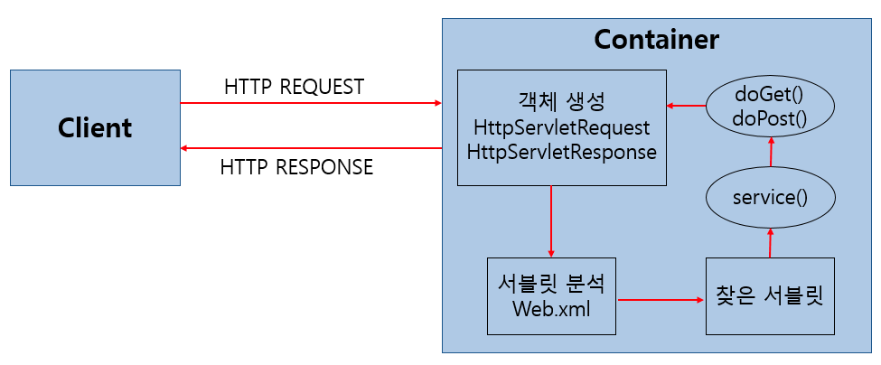

# 서블릿, 서블릿 컨테이너, JSP

## 서블릿

* 자바를 이용하여 웹페이지를 동적으로 생성하는 서버측 프로그램. 혹은 그 사양 (위키백과)
* JSP는 HTML 문서 안에 자바 코드가 있지만, 서블릿은 자바코드 안에 HTML이 있다.
* Java EE의 일부.

### 특징

1. 클라이언트의 요청에 대해 동적으로 작동하는 웹 어플리케이션 컴포넌트
2. HTML을 사용하여 요청에 응답
3. Java Thread를 이용하여 동작
4. MVC 패턴에서 Controller로 이용됨.
5. Http 프로토콜 서비스를 지원하는 javax.servlet.http.HttpServlet 클래스 상속
6. HTML 변경이 servlet 재컴파일 필요.

## 동작 방식

1. 클라이언트가 URL을 클릭하면 HTTP Request를 Servlet Container로 전송
2. HTTP Request를 전송받은 Servlet Container는 `HttpServletRequest`, `HttpServletResponse` 두 객체를 생성
3. `web.xml`은 사용자가 요청한 URL을 분석하여 어느 서블릿에 대한 요청인지 확인
4. 해당 서블릿에서 service 메소드를 호출한 후 클라이언트의 POST, GET 여부에 따라 `doGet()` 또는 `doPost()` 호출
5. `doGet()` 또는 `doPost()` 메소드는 동적 페이지를 생성한 후 `HttpServletResponse` 객체에 응답을 보냄.
6. 응답이 끝나면 `HttpServletRequest`, `HttpServletResponse` 두 객체를 소멸

## Servlet Container

* 서블릿을 관리해주는 컨테이너.
* 클라이언트의 요청을 받아주고 응답할 수 있게 웹서버와 소켓을 만들어 통신 ex) tomcat
  1. 웹 서버와의 통신 지원
  2. 서블릿 생명 주기 관리
  3. 멀티 쓰레드 지원 및 관리
  4. 선언적인 보안 관리

## JSP(Java Server Page)

* HTML 속에 자바코드 -> 웹서버에서 실행됨
* JSP는 WAS(Web Application Server)에 의해 서블릿 클래스로 변환됨.

출처 : [https://mangkyu.tistory.com/14?category=761303](https://mangkyu.tistory.com/14?category=761303)
