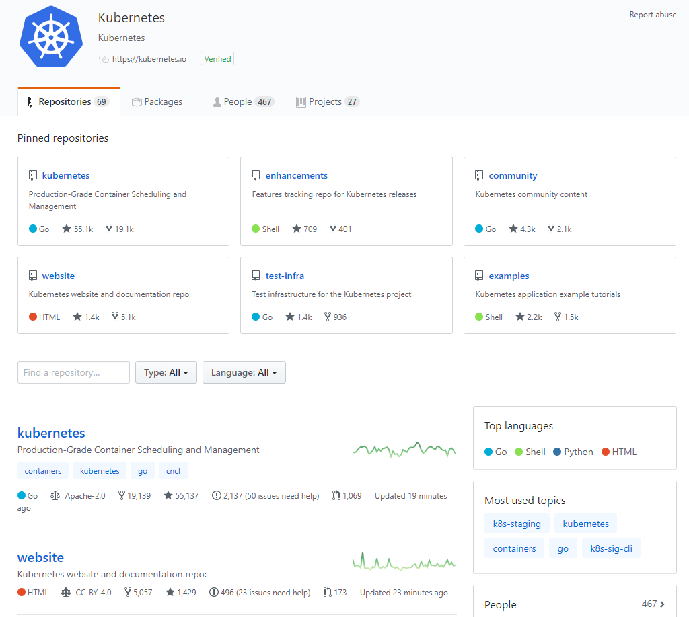
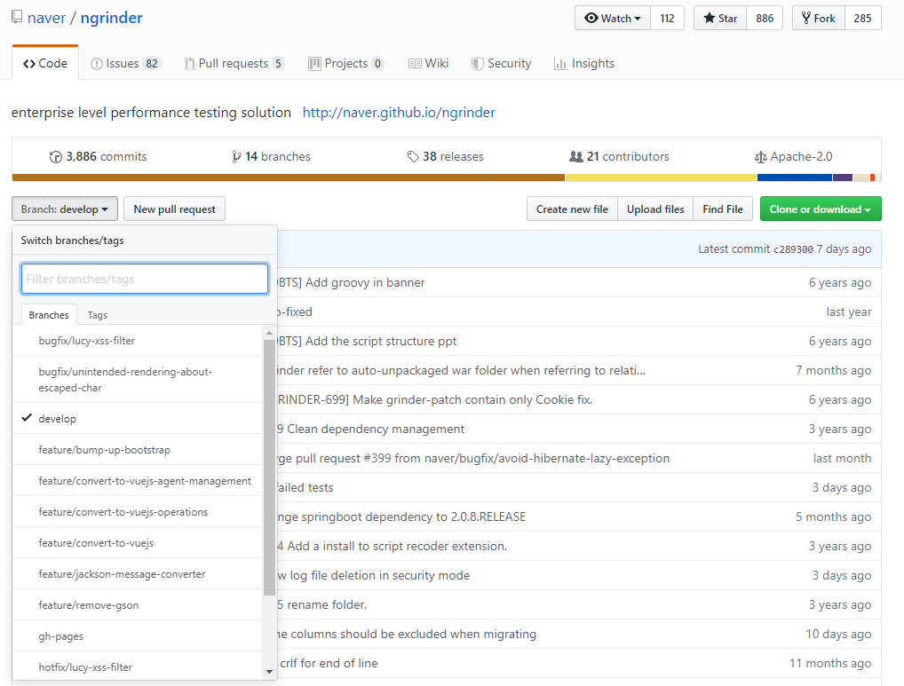

# Git

* repository
* branch
* merge
* push
* pull
* stash
* tag
* commit
* init
* fetch
* diff
* rebase
* checkout
* status
* log
* .gitignore

## basic

### repository

#### 개인 저장소


* 개인별 계정에 등록된 저장소
* 다른 저장소의 것을 fork하여 가져올 수도 있고 자신이 생성할 수도 있다.

#### organization 저장소



* 개인이 모인 그룹이 함께 관리하는 저장소
  * kubernetes/kubernetes, kubernetes/website ...
* 협업이나 오픈소스에 활용

### branch



* 기본적으로 대표되는 브랜치는 master 브랜치 - 배포했거나 배포된 코드
* develop - 다음에 배포할 코드
* feature - 특정한 topic에 대한 코드
* hotfix - 운영버전에 생긴 버그 해결을 위한 브랜치
* 즉, 업무별로 쪼개서 코드를 작성할 수 있고 나중에 master 브랜치로 merge하면 완성!

### init

* 처음 레파지토리를 생성할 때 사용

  

  ```bash
  mkdir gittest
  cd gittest
  ls -al # 폴더 내 모든 디렉토리 확인
  touch README.md # repository에 들어갔을 때 가장 먼저 보이는 파일
  git init
  ls -al # .git 폴더 생성 확인
  git add README.md # stage에 REAMDME.md 파일 추가
  git status # changes to be committed에 추가된 것 확인
  git commit -m "add readme.md"
  # 에러 발생 시 git config user.name, git config user.email 설정
  git remote -v # 아무것도 뜨지 않음
  git remote add origin http://10.251.164.209:3000/myeongjin/gittest.git
  git push -u origin master
  ```

  

### fork

* 공개된 repository를 개인 repository로 복사
* fork 해보기

### clone

* repository를 pc로 불러옴

### pull

* 원격 저장소에 저장된 내용을 로컬 저장소로 불러올 때 사용

### push

* local repository의 내용을 원격 저장소로 업데이트 할 때 사용

### commit

* 수정한 tracked 파일을 stage에 기록

### add

* untracked 파일을 tracked 상태로 변경
* `.` 은 모든 파일을 의미

### status

* 파일들의 상태 확인 (untracked, tracked, modified, deleted ..)

### log

* commit 내역 확인

### checkout

* 특정한 commit으로 이동

### remote 

* 현재 프로젝트에 등록된 리모트 저장소

### 실습

1. PaaS_Toolset_TF/testRepositoryOrg를 개인 계정으로 fork

2. ```bash
   mkdir test
   cd test
   mkdir v1 v2
   cd v1
   git clone http://10.251.164.209:3000/myeongjin/testRepositoryOrg-forked.git
   cd ../v2
   git clone http://10.251.164.209:3000/myeongjin/testRepositoryOrg-forked.git
   cd ../v1/testRepositoryOrg-forked
   cat <<EOF > hello.md
   hello world!
   EOF
   git status # untracked file
   git config user.email m5.kim@samsung.net
   git config user.name myeongjin
   git commit -m 'a' # nothing added to commit but untracked files present
   git add hello.md # or git add .
   git status # new file
   git push # Everything up-to-date
   git commit -m 'hello world'
   git push -u origin master # -u : set upstream, master : branch name
   git staus
   ## 웹페이지에서 확인
   cd ../../v2/testRepositoryOrg-forked
   git status
   git pull # hello.md 생성
   git log
   git checkout c837
   ls # hello.md 파일 사라짐
   git checkout fdbb
   git remote -v
   ```

3. testRepository로 이동 (multus-cni) -> 10.251.164.209(gitea) -> multus-cni

4. github-repository-test 이동(kimmj/private) -> 10.251.164.209(gitea) -> private

5. git remote -v 확인

## Etc

### rebase

### cherrypick

### stash

### merge

### fetch

### .gitignore