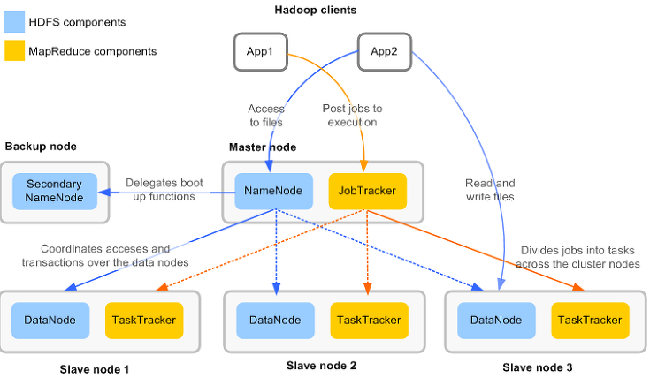
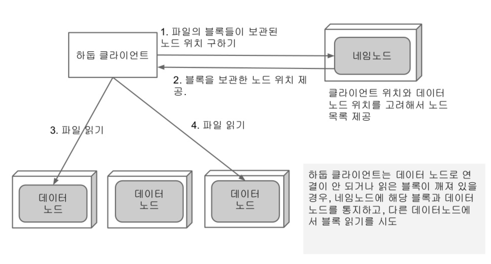
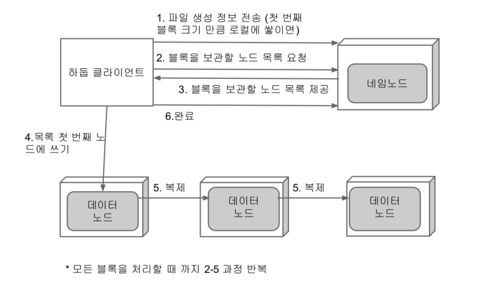

# Hadoop 이란?

* 대용량 데이터 분산처리 프레임워크

**배포판**

1. Apache
2. Cloudera
3. HortonWorks
4. MapR

## Hadoop 전체 구성

* MapReduce -> 분산에서 프로그램 모델에 해당.

### HDFS components

1. NameNode : HDFS의 모든 메타데이터를 관리
2. DataNode : 실제 블럭들을 저장. 주기적으로 NameNode에게 heartbeat와 블록 리포팅을 보냄
3. Secondary NameNode

### MapReduce components

1. JobTracker : 스케쥴링, 모니터링
2. TaskTracker : 명령을 받고 수행(map task, reduce task)을 하는 데몬.

## 파일 읽기

## 파일 쓰기

## NameNode High Availability

* Hadoop 1의 네임노드는 SPOF(Single Point Of Failure) : 네임노드가 망가지면 시스템 붕괴
* Hadoop 2부터는 Active, Standby 네임노드로 SPOF를 제거. (2개 사용)

## MRv1 -> MRv2

* JobTracker -> Resource Manager, JobHistory Server, Application Master
* TaskTracker -> Node Manager
