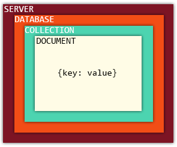

# MongoDB

* 크로스 플랫폼 도큐먼트 지향 데이터베이스 시스템.
* NoSQL 데이터베이스
* 뛰어난 확장성 및 성능
* 관계형 DB가 아니므로 RDMS처럼 고정된 스키마 및 JOIN이 존재하지 않음.



## Document

* RDMS 에서의 record와 비슷한 개념.
* 한개 이상의 key-value pair로 이루어져 있음.

```
{
    "_id": ObjectId("5099803df3f4948bd2f98391"),
    "username": "velopert",
    "name": { first: "M.J.", last: "Kim" }
}
```

* '\_id', username, name은 key값.
* 오른쪽은 Value
* dynamic schema : 같은 Collection 안에 있는 Document까리 다른 schema를 가질 수 있음.

## Collection

* MongoDB의 그룹.
* Document들이 Collection 내부에 위치.
* RDMS의 table과 비슷한 개념이지만 RDMS와 달리 schema를 따로 가지고 있지 않음.

## Database

* 각 Collection의 물리적 컨테이너

## Data Modeling

### Schema 작성시 유의사항

* 사용자의 요구에 따라 schema를 디자인한다.
* 객체들을 함께 사용하게 된다면 한 Document에 합쳐서 사용한다. 그렇지 않으면 따로 사용한다.
* 읽을때 join하는게 아니라 데이터를 작성할때 join한다.
