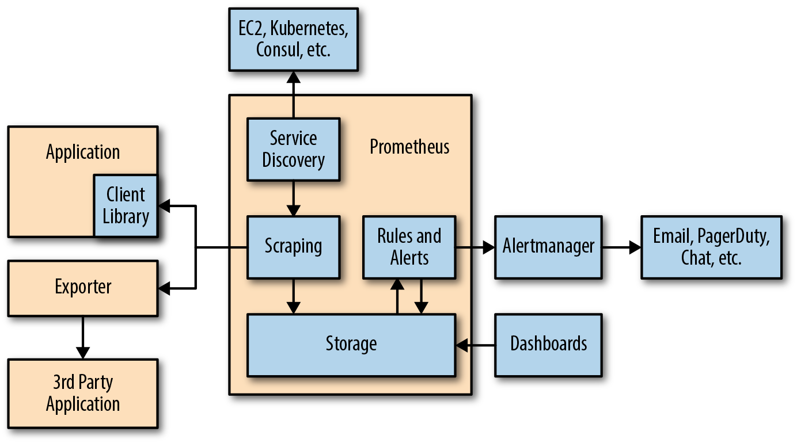

# 1장 프로메테우스란 무엇인가

* 프로메테우스는 메트릭 기반의 모니터링 툴.
* PromQL(Prometheus Query Language)
* 간단한 텍스트 형식을 통해 쉽게 메트릭 게시 가능.
* 데이터 모델은 이름과 label로 불리는 key-value 쌍으로 이루어진 비정렬 세트로 모든 시계열을 구분한다.
  * PromQL 쿼리 언어로도 이런 레이블 중 일부를 집계할 수 있음.
* alert는 그래프 작성에 사용하는 것과 동일한 PromQL로 정의할 수 있음.

## 모니터링이란 무엇인가

* alerting : 문제가 발생한 시기나 시점 파악하는 것
* debugging : 원인 파악
* trending : 추세 파악
* plumbing : ??

### 모니터링의 범주

* 이벤트들에 대해서 컨텍스트를 파악해야한다.
* 모든 이벤트에 대해서 파악하는 것은 처리 및 저장해야 할 데이터를 늘림.
  * 프로파일링, 트레이싱, 로깅, 메트릭 4가지 방법.

#### 프로파일링

* 제한된 기간의 일부 컨텍스트를 가질 수 있다는 방식.

#### 트레이싱

* 모든 이벤트를 살펴보는 것이 아니라 관심 기능을 통과하는 일부 이벤트처럼 수백 개의 이벤트 중 특정 이벤트에만 집중.
* 분산 트레이싱은 원격 프로시저 호출에서 한 프로세스에서 다른 프로세스로 전달되는 요청에 고유한 ID를 추가하여 해당 요청이 추적되어야 하는지 여부 등 프로세스 전반에 걸친 작업을 추적.

#### 로깅

* 제한된 이벤트 집합을 살펴보고 각 이벤트에 대한 컨텍스트 일부를 기록
* 샘플링이 없음.
* 로깅 종류
  * transaction logs : 영원히 안전하게 기록해야하는 중요한 비즈니스 기록
  * request logs : 모든 HTTP 요청이나 DB 호출을 추적(track)하는 경우의 로그
  * application logs : 프로세스 그 자체에 관한 로그. 보통 사람이 직접 읽기 때문에 정상동작에서는 1분당 몇개가 적절.
  * debug logs : 상세한 로그. 매우 협소한 디버깅 상황에만 사용. 프로파일링 특성을 띔.

#### 메트릭

* 컨텍스트를 대부분 무시하고 다양한 유형의 이벤트에 대해 시간에 따른 집계(aggregation)를 추적
* 프로세스당 1만 개의 메트릭 처리 정도가 합리적인 상한선.
* 애플리케이션의 각 서브시스템에서의 대기 시간과 처리하는 데이터 양을 추적해서 성능 저하의 원인이 정확히 무엇인지 손쉽게 알아낼 수 있음.

* 메트릭은 프로세스 전반에 걸쳐 이벤트 정보를 수집할 수 있지만, 일반적으로 카디널리티가 제한된 컨텍스트는 1~2개 이상의 필드를 갖지 않는다. 
* 로그는 한 가지 유형의 이벤트에 대해 모든 정보를 수집할 수 있지만, 카디널리티가 제한되지 않은 컨텍스트에 대해 수백 개 필드만 추적할 수 있다.

프로메테우스는 개별 이벤트보다는 전반적인 시스템의 상태와 동작, 성능을 추적하도록 설계되었음.

## 프로메테우스 구조

* 프로메테우스는 service discovery를 통해 데이터 수집 대상을 발견(discover) 함.
* 익스포터를 통해 데이터 수집이 가능한 자체적인 계측 애플리케이션이나 서드파티 애플리케이션 등이 데이터 수집 대상.

### Client Library

* 메트릭을 만들기 위해서는 계측 코드를 추가해야함.
* 2~3줄의 코드로 메트릭을 정의하고, 제어하려는 코드에 inline으로 원하는 계측 기능을 추가할 수 있다.
* direct instruction

### Exporter

* 가져오고 싶은 메트릭을 애플리케이션 바로 옆에 배치하는 소프트웨어.
* 프로메테우스로부터 요청을 받아서 애플리케이션에서 요청된 데이터를 수집하고, 데이터를 올바른 형식으로 변환한 다음, 마지막으로 프로메테우스에 대한 응답으로 데이터를 반환함.

### Service Discovery

* 계측을 위한 모든 애플리케이션이 준비되고 exporter가 실행되면, 프로메테우스는 이들이 어딨는지 찾아야 함.
* 동적환경에서는 자주 바뀌므로 service discovery가 필요.
* Kubernetes에서는 label, annotation을 기준으로. (..?)
* 레이블 재지정을 사용해 모니터링 대상과 드들의 레이블을 매핑하는 메타데이터 구성 방식을 서비스 검색에 허용함.

### 데이터 수집

* service discovery와 relabelling은 모니터링되는 대상 목록을 알려줌.
* 프로메테우스는 수집(scrape)라고 불리는 HTTP 요청을 보내서 메트릭을 가져오는 작업을 수행.
* 정기적으로 수집 요청 발생. 일반적으로 각 대상에 10~60초마다 요청을 보내도록 구성되어있음.

#### Pull-based, Push-based

* 프로메테우스는 pull-based system. 구성에 따라서 데이터의 수집 시기와 대상을 결정.
* 얼마나 자주 모니터링할지를 모니터링 대상이 결정하는 push-based system도 있음.

### 저장 장치

* 사용자 정의 데이터베이스에 로컬로 데이터를 저장함.
* 초당 수백만 개의 샘플을 처리할 수 있음.
* 한 개의 프로메테우스 서버로 수천 대의 머신을 모니터링 할 수 있음.
* SSD를 권장하지만 필수는 아님.

### Dashboard

* expression browser를 제공하여 API를 사용해 부가적인 쿼리와 데이터를 탐지하는 데 적합하지만, 일반적인 대시보드 시스템은 아님.
* Grafana 사용 권장. 하나의 대시보드 패널에서도 여러개의 프로메테우스 서버와 통신하는 기능을 지원.

### 기록 규칙 및 알림

* recording rules를 통해 PromQL 표현식을 정기적으로 수행하고 그 결과를 저장 엔진에 저장할 수 있음.
* alerting rules는 PromQL 표현식을 정기적으로 수행할 수 있으며 이런 표현식에서 나오는 모든 결과는 알림이 됨.
* alert는 Alertmanager로 보내짐.

### 알림 관리

* Alertmanager는 프로메테우슨 서버에서 알림을 받아 통보로 변환함.

### 장기 저장소

* 여러 머신에 데이터를 저장하는 클러스터링 저장 솔루션은 제공하지 않음.
* 대신 원격 read/write API로 PromQL 쿼리가 로컬 데이터와 원격 데이터 모두에서 투명하게 수행 가능.

## 프로메테우스 사용시 고려사항

* 이벤트 로그나 개별 이벤트를 저장하는 데는 적합하지 않음.
* 카디널리티가 높은 데이터에도 좋지 않음.
* 완벽한 데이터를 기다리는동안 모니터링을 중단하는 것이 아니라 99.9% 이상의 모니터링 정확도를 가지는 데이터를 제공하는 것을 선호.

