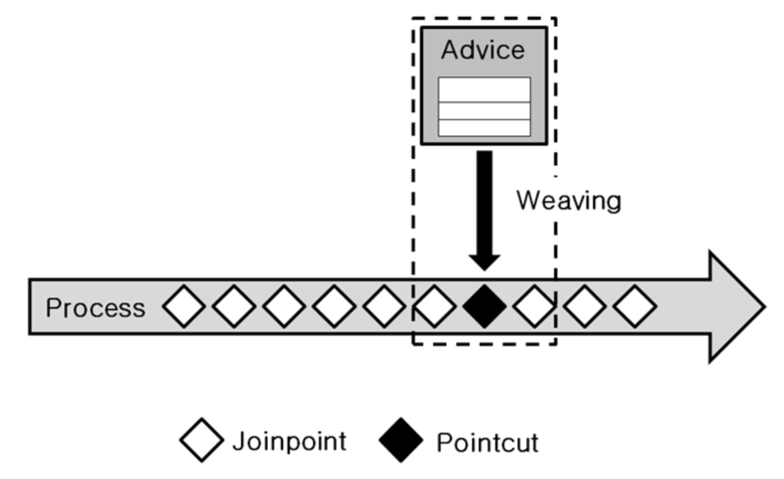
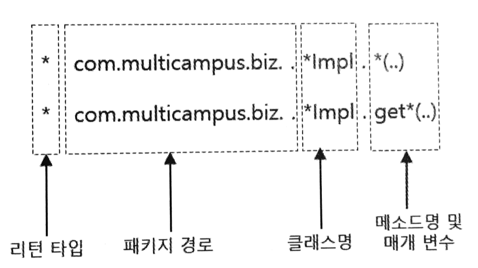

# AOP 용어 및 기본 설정

## AOP 용어 정리

### Joinpoint

* 클라이언트가 호출하는 모든 비즈니스 메소드
* Pointcut 대상, Pointcut 후보 라고도 부를 수 있음.
* 이는 Joinpoint에서 Pointcut이 선택되기 때문

### Pointcut

* 포인트컷은 필터링 된 조인포인트.
* 비즈니스 메소드 중에서 우리가 원하는 특정 메소드에서만 횡단 관심에 해당하는 공통 기능을 수행시키기 위해서 포인트컷이 필요.
* `<aop:pointcut>`으로 선언. id속성으로 포인트컷을 식별하기 위한 유일한 문자열 선언.

### Advice

* 어드바이스는 횡단 관심에 해당하는 공통 기능의 코드를 의미.
* 독립된 클래스 메소드로 작성.
* 어드바이스로 구현된 메소드가 언제 동작할지 스프링 설정파일을 통해서 지정할 수 있음.
* 'before', 'after', 'after-returning', 'after-throwing', 'around'로 지정할 수 있음.

### Weaving

* 포인트컷으로 지정한 핵심 관심 메소드가 호출될 때, 어드바이스에 해당하는 횡단 관심 메소드가 삽입되는 과정을 의미.
* Compiletime Weaving, Loadingtime Weaving, Runtime Weaving이 있고, 스프링에서는 런타임 위빙만 지원.

### Aspect, Advisor

* Aspect는 포인트컷과 어드바이스의 결합.
* 어떤 포인트컷 메소드에 대해서 어떤 어드바이스 메소드를 실행할지 결정
* 이 애스팩트 설정에 따라 AOP의 동작 방식이 결정되므로 가장 중요한 개념.
* `<aop:aspect>` 엘리먼트를 사용하는데 가끔 이 대신에 `<aop:advisor>`를 사용하는 경우도 있음.
* 대표적으로 트랜잭션 상황.

### AOP 용어 종합

## AOP 엘리먼트

스프링은 AOP 관련 설정을 XML 방식과 어노테이션 방식으로 지원한다.

### `<aop:config>` 엘리먼트

* `<aop:config>`는 루트 엘리먼트.
* 스프링 설정 파일 내에서 여러번 사용 가능.
* 이 엘리먼트 하위에는 `<aop:pointcut>`, `<aop:aspect>` 엘리먼트가 위치할 수 있음.

### `<aop:pointcut>` 엘리먼트

* `<aop:pointcut>` 엘리먼트는 포인트컷을 지정하기 위해 사용.
* `<aop:config>`(루트)의 자식이나 `<aop:aspect>`의 자식 엘리먼트로 사용 가능.
* 그러나 `<aop:aspect>` 하위에 설정된 포인트컷은 해당 `<aop:aspect>`에서만 사용가능.

### `<aop:aspect>` 엘리먼트

* 핵심 관심에 해당하는 포인트컷 메소드와 횡단 관심에 해당하는 어드바이스 메소드를 결합하기 위해 사용.

### `<aop:advisor>` 엘리먼트

* 포인트컷과 어드바이스를 결합한다는 점에서 에스펙트와 같은 기능.
* 트랜잭션 설정과 같은 몇몇 특수한 경우에서는 어드바이저를 사용해야 함.
* 어드바이스 객체의 아이디는 확인되지만 메소드 이름을 확인할 수 없을 때 사용 가능.

## 포인트컷 표현식

* 메소드처럼 생긴 execution 명시자를 이용, execution 명시자 안에 포인트컷 표현식을 기술
