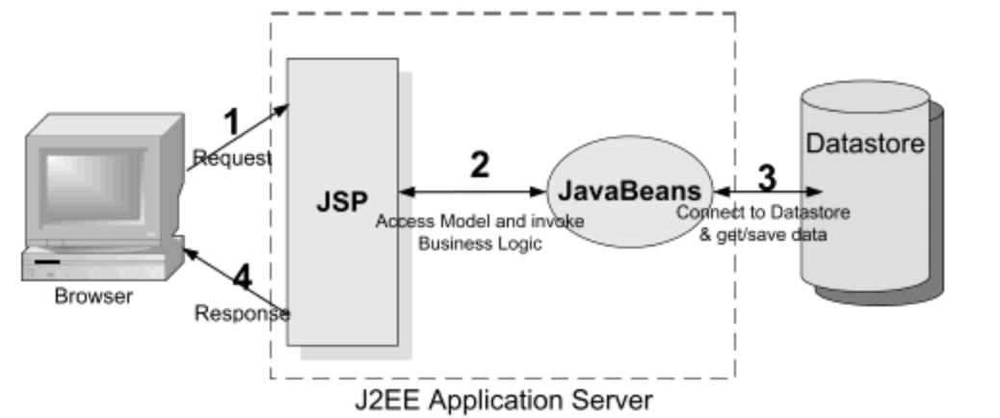
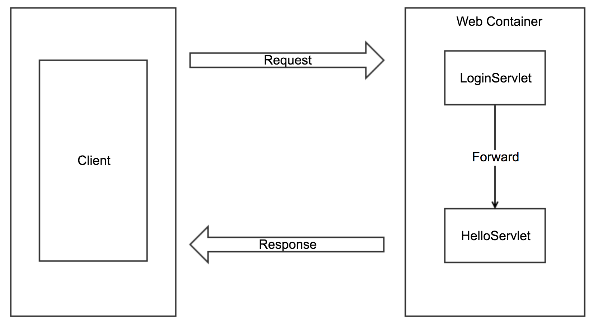
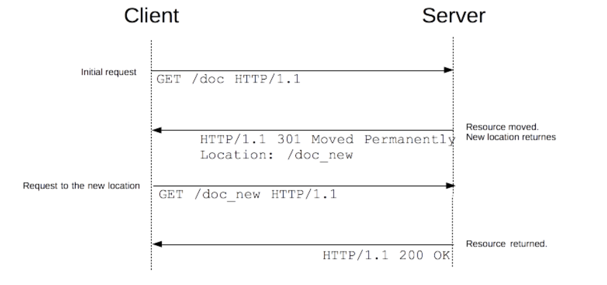

# Model1 아키텍처로 게시판 개발

* 90년대부터 2000년대 초까지 자바 기반의 웹 애플리케이션 개발에 사용되었던 아키텍처
* 여기서 Bean은 "객체"를 의미하므로 결국 JavaBeans는 데이터베이스에 연동되는 자바 객체들이다.
* JSP가 가장 중요한 역할 수행
	* Controller와 View의 기능을 모두 처리하기 때문. 

---

#### Model

* 데이터베이스 연동 로직을 제공하면서 DB에서 검색한 데이터가 저장되는 자바 객체.

#### Controller

* JSP 파일에 작성된 자바 코드를 의미.
* 일반적으로 사용자의 요청 처리와 관련된 자바 코드를 의미
	* 사용자의 입력 정보 추출
	* DB 연동 처리
	* 화면 내비게이션

#### View

* JSP에서 Model을 사용하여 검색한 데이터를 사용자가 원하는 화면으로 제공. 다양한 마크업 사용.
* 마크업으로 HTML, CSS 이용. View 기능 담당

----

* Model1 아키텍처는 JSP 파일에서 View와 Controller를 모두 처리.
* JSP 파일에 자바 코드와 마크업 관련 코드들이 뒤섞여있어서 역할 구분이 명확하지 않음.
* JSP 파일에 대한 유지보수가 어려움.
* 대규모 프로젝트에서는 부적절.
* 나중에 Model2, 즉 MVC(Model View Controller) 아키텍처 등장.

## Foward와 Redirect 차이

### Forward

* 포워드 방식은 RequestDispatcher를 이용하여 응답으로 사용할 JSP 파일을 넘겨서 포워드된 화면이 클라이언트에 전송되는 방식.
* 한번의 요청과 응답으로 처리되므로 실행속도는 빠름.
* 클라이언트 브라우저에서 URL이 바뀌지 않아 응답이 어디에서 들어왔는지 확인할 수 없다.
* Web Container(Tomcat 등..)의 내부에서 이동하기 때문에 request와 response 객체를 공유할 수 있음.

### Redirect

* 리다이렉트는 요청된 JSP에서 일단 브라우저로 응답 메시지를 보냈다가 다시 서버로 재요청하는 방식.
* 응답으로 들어온 파일로 브라우저 URL이 변경되지만, 두 번의 요청과 응답으로 처리되므로 실행속도는 포워드보다 느림.
* 클라이언트에서 새로운 Location에 대해 요청을 하기 때문에 Web Container 내부에서 자원을 공유할 수 없음. 자원을 공유하기 위해선 QueryString을 생성해야함.