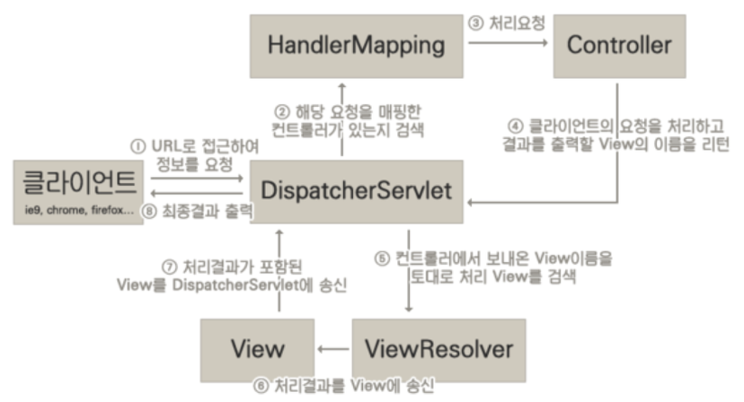

# Model2 아키텍처로 게시판 개발

* 기존에 JSP가 담당했던 Controller 로직이 별도의 Controller 기능의 서블릿으로 옮겨짐.
* 따라서 기존의 Model1에서 JSP 내의 자바 코드만 옮기면 Model2가 됨.
* 결과적으로 Controller로직(자바코드)이 사라진 JSP는 View만 남게되어 디자이너는 JSP파일을 관리하고, 자바 개발자는 Controller와 Model만 관리하면 됨.

| 기능       | 구성 요소                                        | 개발 주체                       |
|------------|--------------------------------------------------|---------------------------------|
| Model      | VO(Value Object), DAO(Data Access Object) 클래스 | 자바 개발자                     |
| View       | JSP 페이지                                       | 웹 디자이너                     |
| Controller | Servlet 클래스                                   | 자바 개발자 또는 MVC 프레임워크 |

* 자바 코드가 들어있는 Controller가 가장 중요한 부분.
* 이 부분을 성능과 유지보수의 편의성을 고려하여 잘 만드는 것이 중요.
* 자바 개발자들이 직접 구현할 수 있지만, MVC 프레임워크가 제공하는 Controller를 사용해도 된다.

## Dispatcher Servlet

* Servlet Container에서 HTTP 프로토콜을 통해 들어오는 모든 요청을 프레젠테이션 계층의 제일 앞에 둬서 중앙집중식으로 처리해주는 Front Controller.
* 즉, Tomcat같은 서블릿 컨테이너가 요청을 받을 때 제일 앞에서 서버로 들어오는 모든 요청을 처리하는 프론트 컨트롤러.
* Dispatcher Servlet이 처리하는 url패턴을 지정해 주어야 한다. 일반적으로는 `*.do`를 이용.
* GET 방식을 처리하는 `doGet()` 메소드와 POST 방식 요청을 처리하는 `doPost()`방식이 있음.
* 어떤 방식이든 `process()`로 요청을 처리.

## HttpServletRequest

* HttpServletRequest는 클라이언트가 서버에 요청을 전송할 때마다 매번 새롭게 생성되며, 응답 메시지가 브라우저에 전송되면 바로 삭제되는 1회성 객체이다.
