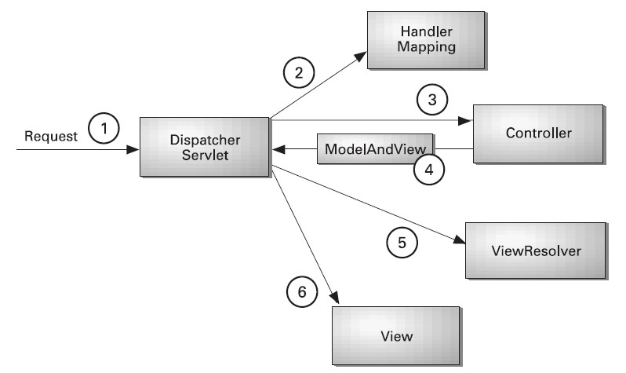

# Spring MVC 구조

## Spring MVC 수행 흐름



1. 클라이언트로부터의 모든 등록된 요청(`*.do`)을 `DispatcherServlet` 이 받는다.
2. `DispatcherServlet` 은 `HandlerMapping` 을 통해 요청을 처리할 `Controller` 를 검색한다.
3. `DispatcherServlet` 은 검색된 `Controller` 를 실행하여 클라이언트의 요청을 처리한다.
4. `Controller` 는 비즈니스 로직의 수행 결과로 얻어낸 Model 정보와 Model을 보여줄 View 정보를 `ModelAndView` 객체에 저장하여 리턴한다.
5. `DispatcherServlet` 은 `ModelAndView` 로부터 View정보를 추출하고, `ViewResolver` 를 이용하여 응답으로 사용할 View를 얻어낸다.
6. `DispatcherServlet` 은 `ViewResolver` 를 통해 찾아낸 View를 실행하여 응답을 전송한다.

## `DispatcherServlet` 등록 및 스프링 컨테이너 구동

1. 클라이언트가 `*.do` 요청을 서버에서 전달하면 서블릿 컨테이너는 `web.xml` 파일에 있는 `DispatcherServlet` 클래스 객체를 생성.
2. `DispatcherServlet` 객체가 생성되고 나면 `DispatcherServlet` 클래스에 재정의된 `init()`메소드가 자동으로 실행되어  `XmlWebApplicationContext` 라는 스프링 컨테이너가 구동됨. (`DispatcherServlet` 이 생성)
3. 결국 스프링 설정파일(xml파일)에 `DispatcherServlet` 이 사용할 `HandlerMapping`, `Controller`, `ViewResolver` 클래스를 `<bean>`등록하면 스프링 컨테이너가 해당 객체들을 생성해줌.

* Spring MVC의 구성요소 중에서 `DispatcherServlet` 가 유일한 서블릿.
* 따라서 서블릿 컨테이너는 `web.xml` 에서 `DispatcherServlet` 만 생성.
  * 이 때 재정의된 `init()`함수가 자동으로 실행됨.
* 그러나 `DispatcherServlet` 은 혼자서 클라이언트의 요청을 처리할 수 없고, 반드시 `HandlerMapping`, `Controller`, `ViewResolver` 객체들과 상호작용 해야함.

## Spring 설정 파일 변경

* 원래는 `/WEB-INF/???-serlvet.xml` 파일을 찾아 로딩.
* 이는 `web.xml` 파일에서 `DispatcherServlet` 클래스를 등록한 곳에 `<init-param>`설정을 통해서 바꿀 수 있음.

```xml
<servlet>
  <servlet-name>action</servlet-name>
  <servlet-class>org.springframework.web.servlet.DispatcherServlet</servlet-class>
  <init-param>
    <param-name>contextConfigLocation</param-name>
    <param-value>/WEB-INF/config/presentation-layer.xml</param-value>
  </init-param>
</servlet>
```

## 인코딩 설정

* 스프링에서는 인코딩 처리를 위해 `CharacterEncodingFilter` 클래스를 제공, `web.xml` 파일에 `CharacterEncodingFilter` 를 등록하면 모든 클라이언트의 요청에 대해 일괄적으로 인코딩 처리 가능.
