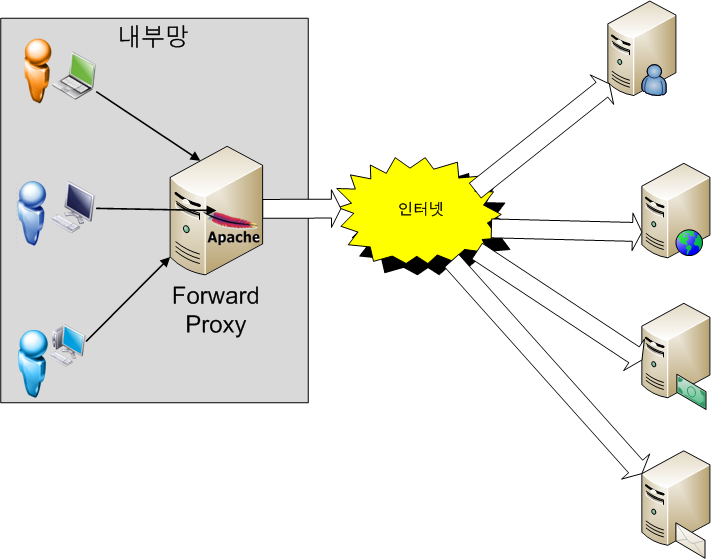

# Forward proxy and Reverse proxy

## Forward Proxy

* client가 example.com이라는 url에 연결하고자 하면 사용자 PC가 직접 연결하는 것이 아니라 Forward Proxy Server가 요청을 받아 example.com에 연결하여 그 결과를 client에 forward(전달)해준다.
* 보통 cache를 사용하여 자주 사용되는 컨텐츠에는 좋은 성능을 띈다.
* 정해진 사이트만 연결하도록 하여 웹 사용 환경을 제한할 수 있다.

## Reverse Proxy

* client가 example.com 웹서비스에 data를 요청하면 Reverse Proxy는 이 요청을 받아 내부 서버에서 data를 받은 후 data를 client로 forward한다.
* 보안상의 이유가 크다.
* 보통의 기업 네트워크 환경은 DMZ라고 하는 내부 네트워크와 외부 네트워크 사이에 위치하는 구간이 존재한다.
  * 이 구간에는 메일 서버, 웹 서버, FTP 서버등 외부 서비스를 제공하는 서버가 위치한다.
* example.com을 서비스하는 회사는 서비스를 자바로 구현하여 WAS를 DMZ에 놓고 서비스해도 되지만 WAS는 보통 DB와 연결이 되므로 WAS가 최전방에 위치하면 WAS가 해킹을 당했을 때 DB서버까지 해킹을 당한다.
* 때문에 Reverse Proxy Server를 두고 실제 서비스 서버는 내부망에 위치시키고 Proxy Server만 내부에 있는 서비스 서버와 통신해 결과를 client에 제공하는 방식으로 서비스한다.
  * Linux의 경우 Reverse Proxy로 Apache Web Server를 사용한다면 SELinux를 켜 웹서버는 tomcat의 8080, 8009 port만 접근 가능하게 해 웹서버가 해킹을 당해도 내부망으로 접근이 불가능하게 한다.

----------

https://www.lesstif.com/pages/viewpage.action?pageId=21430345