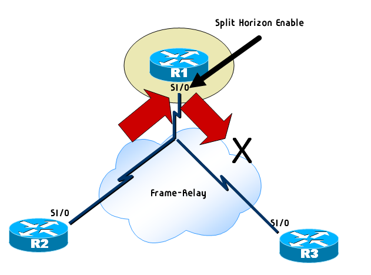

# Split Horizon

* Routing Loop을 방지하기 위한 규칙 중 하나

* 정보를 받은 인터페이스(포트)를 통해 같은 정보가 나가는 것을 방지하는 매커니즘

  * 어떤 루트 정보를 얻은 쪽의 인터페이스에서 다시 그 방향으로 그 루트 정보를 광고하지 말도록 함

* Default로 enable되어 있어서 Routing Loop을 방지하는데 경우에 따라서 disable해야 하는 경우가 있다.

  

  * NBMA에 환경에서 Hub and Spoke 환경에서는 Split Horizon을 꺼야 라우팅 정보가 전달된다.
  * 위의 그림에서 R1같은 인터페이스(s1/0)을 통해 R2와 R3를 연결하고 있어 라우팅 정보가 들어오고 나감이 같을수밖에 없다.

-----------

https://blog.naver.com/kwi3094/120043232488